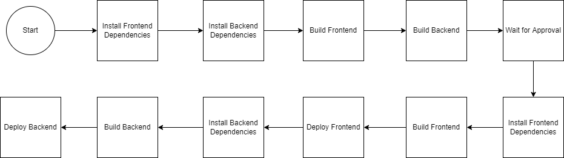

## Steps

1. Install Frontend Dependencies
2. Install Backend Dependencies
3. Build Frontend
4. Build Backend
5. Await approval
6. Install Frontend Dependencies
7. Build Frontend
8. Deploy Frontend
9. Install Backend Dependencies
10. Build Backend
11. Deploy Backend
